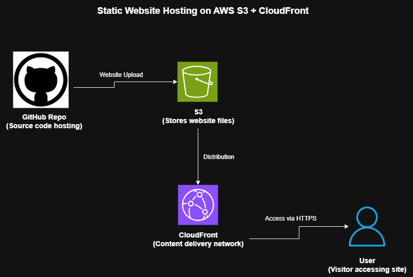

# 🌩️ Project 1 — AWS Static Website Hosting

**Engineer:** Afrooz Habib  
**Role:** DevOps Engineer (Fresher)  

---

## 📖 Overview
This project demonstrates hosting a static website on **AWS S3** with **CloudFront CDN** for global, secure, and fast delivery.  
It’s the foundation of my DevOps journey — building cloud automation and infrastructure understanding from scratch.

---

## 🧩 Architecture

**Flow:**
1. Website files uploaded to an **S3 Bucket**.
2. Bucket configured for **Static Website Hosting**.
3. **Bucket Policy** allows public read access.
4. **CloudFront** distribution used as CDN with HTTPS.
5. Users access via CloudFront domain.

---

## ⚙️ Tools & Technologies

| Tool | Purpose |
|------|----------|
| AWS S3 | Static website hosting |
| AWS CloudFront | CDN for caching and HTTPS |
| AWS IAM | Access management |
| Git & GitHub | Version control |
| draw.io | Architecture diagram |
| HTML/CSS | Website frontend |

---

## 🧠 Key Steps

1. Create S3 bucket and enable static website hosting.  
2. Upload website files (`index.html`, `error.html`).  
3. Add public bucket policy.  
4. Configure CloudFront distribution using the S3 endpoint.  
5. Wait for deployment and verify via CloudFront URL.

---

---

## 🧠 Learnings
- Hosting static content on AWS using S3.  
- Integrating S3 with CloudFront for global content delivery.  
- Understanding public access policies in IAM.  
- Building DevOps documentation and portfolio project structure.

---

